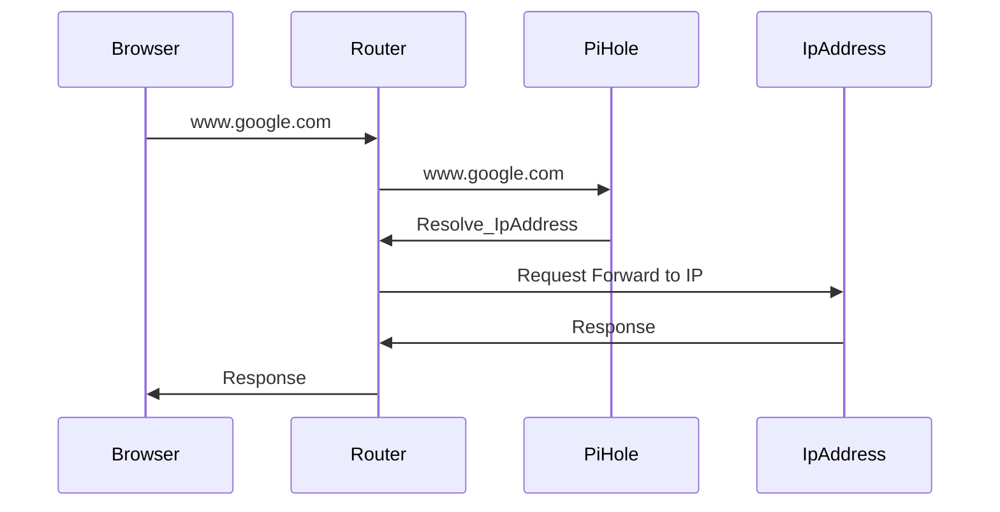

# Overview <!-- omit in toc -->

Initial Kick off conversation about HomeLab.

- [Questions and Answers](#questions-and-answers)
  - [What is a HomeLab?](#what-is-a-homelab)
  - [Why a HomeLab?](#why-a-homelab)
  - [What are Goals for setting up a HomeLab?](#what-are-goals-for-setting-up-a-homelab)
    - [Let's cover non-virtualized env (your PC)](#lets-cover-non-virtualized-env-your-pc)
    - [Next Let's talk about Virtualization (VMs/Docker)](#next-lets-talk-about-virtualization-vmsdocker)
  - [What is on the Learning Agenda](#what-is-on-the-learning-agenda)
  - [Where do we start?](#where-do-we-start)
    - [Planning the Cluster](#planning-the-cluster)
    - [Additionally, how are we going to access things that are running in the cluster once its up and running?](#additionally-how-are-we-going-to-access-things-that-are-running-in-the-cluster-once-its-up-and-running)
    - [What other Questions?](#what-other-questions)
      - [How exactly does Pi-Hole work?](#how-exactly-does-pi-hole-work)
    - [Build Virtual Machines](#build-virtual-machines)

## Questions and Answers

### What is a HomeLab?

A Homelab is exactly what it sounds like: it's a personal environment or a digital playground that you set up in your own home. It can be a simple spare desktop, or a dedicated server rack in the closet. This also include all of the networking pieces that ties everything together. Essentially a Private Cloud.

### Why a HomeLab?

For me the HomeLab is for learning, building MVPs, Proof of Concepts as well have things that I need at home. For Example, Use Pi-Hole to block ads on all of our devices. Applications I create for my family.

I want to have an environment setup that will allow me to just working on POCs instead of setting up infrastructure each and everytime I want to create a new project.

### What are Goals for setting up a HomeLab?

1. Kubernetes up and running, so I can spin up various workloads, For example - a Web Application or a console application that is going to be working on a long running process (a background job), MongoDB, Redis Cache, RabbitMQ, etc.

2. Observability Stack for Logs, Metrics and Traces ready to go, so when I start working on a new application I don't have to keep setting it up over and over again.

Wait can you not do this with Docker or just run a web application in IIS on your PC?

Definitely. The biggest differences are going to be in how code is deployed. Deployment of the code can be manual or scripted. Are we going to adhere to some standards?

#### Let's cover non-virtualized env (your PC)

1. You can spin up a nodeJS web server and have it service a website. so why not? definitely quick
2. In order to bind SSL certificates, it has to be done manually. ONLY if you want to use https. this is also not necessary. However, the practices we use in the homelab, will become kinda like muscle memory. So if we learn secure best practices of using https at home, it will ensure we are keeping this in mind when at work. Instead of a different train of though.
3. You have to bind a route to the website. Using the Host file.
4. You have to figure out how to deploy. You can come up with some standards, but they won't be industry standards. That requires a lot of other infrastructure for CI/CD.

This can all be done by automation, but that automation also has to be maintained.

#### Next Let's talk about Virtualization (VMs/Docker)

One thing to note before we get into this discussion. Is the distinction between Docker Conatiner vs Docker Desktop (or CLI). We are discussing Docker Desktop here and when we refer to container, we are implicitly referring to Docker Conatiner.

1. Docker Desktop is a container orchestrator. You can use Docker Compose to spin up a service that requires multiple containers and some coordination.
2. Docker Desktop has it's networking quirks that are different than Virtual Machine or K8s.
   1. The challenges that will be encountered during "deployment" are going to be different than the ones that we encounter at work when using Kubernetes. Conceptually they are the same, but when scripting or creating automation the underlying artifacts are different.

### What is on the Learning Agenda

In order to setup a Kubernetes Cluster, there is a whole host to techonologies I need to learn or refresh some.

1. Powershell Scripting
   1. Create Virtual Machines in Hyper-V (Virtual Box if you are on MacOS / Linux).
1. Linux OS - clearly not in it's entirety
   1. Understand group permissions
   1. Understand pre-requisites for k8s [^1]
1. Bash Scripting to install pre-requisites for K8s
1. Helm [^2] - Package manager for K8s
1. CNI - Cilium [^3] - Service Mesh
1. Open Telemetry (OTEL)
1. Grafana Stack (Grafana - Loki - Tempo - Prometheus)
1. Harbor - Private Container Registry
1. Longhorn - Storage Class
1. k9s (Alternative - Racher Desktop)

and the list goes on and on.

The idea is to explore each of these enough to be able to get to my end goal of having an environment setup that I can quickly start to prototype and learn technologies we use at work.

[^1]: [Kubernetes Documentation - Before you begin](https://kubernetes.io/docs/setup/production-environment/tools/kubeadm/install-kubeadm/#before-you-begin)
[^2]: [Helm Documentation](https://helm.sh/)
[^3]: [Cilium Documentation](https://docs.cilium.io/en/stable/)

### Where do we start?

#### Planning the Cluster

The K8s cluster will consist of a control plane and two worker nodes. You can adjust the resources to what you have available.

- Control Plane VM is going to need 2 cores, 8 Gb Ram and 100 GB storage.
- Workder Nodes are going to be assigned 5 cores, 32 GB Ram each and 100 GB storage.

#### Additionally, how are we going to access things that are running in the cluster once its up and running?

I want to be able to navigate to Grafana instance that is running in the cluster from any device that I have connected to my local network. I want the url to be something like `grafana.nscubed.lan`. How do we do that?

  1. To Translate `grafana.nscubed.lan` to an ipaddress plus port number can be done via DNS. So there are lots of options - one I am going to setup Pi-Hole. Pi-Hole has an added benefit of ad blocking for all of the devices on the network! This is great. however, you need a router that allows you off-load DNS queries!
     1. I have a NetGear router for now that allows me to specify an ip address that I want to use for DNS. Additionally fallback DNS address for Google and Cloudflare are in the router. so in the event that my homelab is turned off, the house can still function.
  2. We need a utility VM with 1 Cores, 4 Gb Ram and 20 GB. We can always increase the size later if we find that it's struggling.

#### What other Questions?

##### How exactly does Pi-Hole work?

#### Build Virtual Machines
