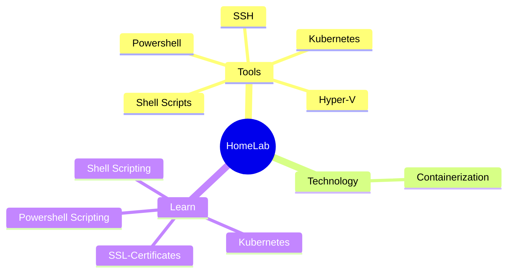

# HomeLab

The idea of a HomeLab is perfect since I need a place to deploy the various app I want to build. This would give me a place to test the app out of my local machine. Additionally, a HomeLab would allow me ideate, explore and most importantly learn new and emerging technologies!

That sounds like a fantastic idea, where to start? Let's start with a mindmap and see where that will lead us.

## Next Steps

- [x] Create PKI for HomeLab
  Kubernetes has [Public Key Infrastructure (PKI)](https://kubernetes.io/docs/setup/best-practices/certificates/) and I want to be able to use https in my HomeLab. So I need to dig into how to create a Certificate Authority (CA). I want to create a Root Certificate Authority which I will install on all of our devices and intermediate certificates that are signed using the Root CA can validated and we will not see the error that certificate cannot be trusted.
